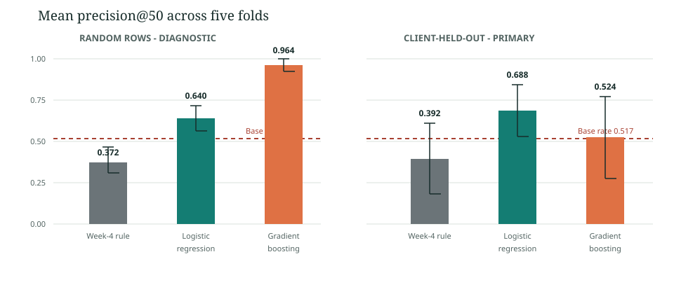

# Can March Signals Prioritize Content for April Review?

**Author:** Ashritha Chary  
**Program:** FlyRank ML Internship  
**Date:** 29 September 2026  
**Repository:** [Ashritha-boop/fly_machine](https://github.com/Ashritha-boop/fly_machine)  
**Deployed paper:** [Research paper](../docs/index.html)

## Title + Abstract

This study asks whether March measurements can rank content items at higher risk of an April impressions drop for limited editorial review. It queries the FlyRank internship warehouse's daily performance fact table and content dimension, yielding 143,206 eligible March-April content/client pairs across 45 clients from a release containing about 79 million daily records. Regularized logistic regression and histogram gradient boosting were compared with a fixed Week-4 rule using five client-held-out folds, while random-row splits were retained only as a weaker diagnostic. Across client-held-out folds, logistic regression achieved mean precision@50 of 0.688 versus 0.392 for the rule and a test base rate of 0.517; because model selection used those same folds, this result is exploratory rather than an untouched test. The result supports further evaluation of human-review prioritization, but it does not establish refresh uplift, predict search rankings, or guarantee performance on future months.

## Introduction / Problem statement

An editor has more pages to review than time to review them. The question is whether observable search and content signals can help order that review without pretending that a score knows which edit will work.

Using measurements available by 31 March 2026, can a model rank eligible content items that show a large observed impressions drop in April more effectively than a transparent rule? The intended output is a review order for a human editor, not an automated refresh decision. The unit is one pseudonymized content item within a client. A false positive spends review time on an item that does not cross the proxy threshold; a false negative leaves a declining item lower in the review order.

## Data

The analysis uses the gated [FlyRank/internship-warehouse](https://huggingface.co/datasets/FlyRank/internship-warehouse) Parquet release, described by the project as roughly 79 million daily search-performance rows. The query reads `fact_content_daily_performance` and joins `dim_content` on pseudonymous content and client hashes. The evaluated frame is not 79 million model observations: it contains 143,206 eligible content-client pairs across 45 clients after aggregation.

- **Feature window:** 1-31 March 2026; March impressions, clicks, average position, GA4 sessions/availability, and content age as of 31 March.
- **Label window:** 1-30 April 2026; label is 1 when April impressions are below 80% of March impressions.
- **Eligibility:** paired March/April records, at least 10 March impressions, and non-missing required March measurements and content age.
- **Excluded:** identifiers as features, April outcome values, target-derived trend fields, product decision outputs, and rows missing required predictor data.
- **GA4 handling:** sessions are used only when `ga4_data_available IS TRUE`; missing sessions are imputed within each training fold, with the availability flag retained.

The analysis is conditional on paired-month measurement availability and the March impression floor. Hashed identifiers are used only for joins and client-grouped validation. No client names, domains, page URLs, titles, raw queries, hashed IDs, row-level examples, or warehouse data are published or committed. The source release revision is not pinned to a content-addressed identifier.

## Methodology

**Features (seven):** March GSC impressions, clicks, average position; March GA4 sessions and availability; content age as of 31 March; and a March position-availability flag. IDs, April impressions, the target, trend-derived fields, and product decision outputs are prohibited from model inputs. The leakage audit asserts these exclusions and checks that all feature timing precedes the April label window.

**Label:** `is_declining_label = 1` when April impressions are less than 80% of March impressions. This is a monthly decline proxy, not a future business outcome or treatment response.

**Models:** Logistic Regression with median imputation and standardization; HistGradientBoosting with median imputation (120 iterations, at most 15 leaves, minimum leaf size 30, L2 regularization 1). Random seed: 42.

**Baseline:** The fixed Week-4 rule scores only items at least 180 days old, with at least 500 March impressions and average position 4 or worse. Its score is March impressions divided by average position plus one. The rule and models are evaluated on the same test rows and reported with the same metrics.

**Validation:** Five-fold GroupKFold by client across 45 clients is primary. Five 80/20 random-row splits are shown as a weaker diagnostic because clients may appear in both train and test. Metrics are unweighted fold means; standard deviations describe fold variation and are not confidence intervals. The top model is selected by mean grouped-fold precision@50 on the same folds on which it is evaluated, so these results are exploratory rather than sealed-holdout estimates.

## Results

| Split | Method | Test base rate | Precision@50 (mean +/- SD) | Average precision |
|---|---|---:|---:|---:|
| Random rows (diagnostic) | Week-4 rule | 0.517 | 0.372 +/- 0.079 | 0.510 |
| Random rows (diagnostic) | Logistic Regression | 0.517 | 0.640 +/- 0.075 | 0.578 |
| Random rows (diagnostic) | HistGradientBoosting | 0.517 | 0.964 +/- 0.038 | 0.744 |
| Client-held-out (primary) | Week-4 rule | 0.517 | 0.392 +/- 0.214 | 0.512 |
| Client-held-out (primary) | Logistic Regression | 0.517 | 0.688 +/- 0.157 | 0.560 |
| Client-held-out (primary) | HistGradientBoosting | 0.517 | 0.524 +/- 0.248 | 0.560 |

On the primary client-held-out folds, Logistic Regression measured mean precision@50 0.296 above the rule and 0.171 above the test base rate. Its mean average precision was 0.560 versus 0.512 for the rule. HistGradientBoosting's random-row precision@50 of 0.964 fell to 0.524 when whole clients were held out, illustrating split sensitivity. The model is selected on these same grouped folds, so no confirmatory claim is made.

The chart shows mean precision@50 with +/- one fold standard deviation; the red line is the 0.517 base rate. Fold spread is descriptive and is not a confidence interval. The same chart is regenerated by the capstone notebook.

## Limitations & honest framing

- The label is a thresholded April impressions proxy, not human-assessed page quality, a future search outcome, or an observed response to a refresh.
- This is one March-to-April transition. Paired coverage and the minimum March impression threshold condition the eligible population.
- Model selection and evaluation share the same five client-held-out folds. Grouping reduces client overlap but does not establish transfer to future months or an untouched test population.
- Scores are not calibrated. At an illustrative 0.5 cutoff, the audit counted 37,681 false positives and 35,145 false negatives; these counts are not the ranking metric. Error rates were 0.471 for content under 180 days, 0.554 for 180-365 days, and 0.525 over 365 days, descriptive subgroup results only.
- No refresh interventions, recovered clicks, editorial effort, revenue, or user outcomes were measured. The analysis supports no causal uplift, ROI, search-ranking prediction, or guaranteed performance claim.
- The gated source revision is not content-addressed in the notebook, and data/library changes may alter reruns.

A separate click-decline analysis in the validation notebook uses a different target and population; its metrics are not combined with this impressions study.

## Ranked recommendations

1. **Pilot as a human-reviewed ranking aid only.** The grouped-fold result is promising for this proxy but provisional because model selection used the evaluation folds.
2. **Verify current measurements and eligibility.** Check paired windows, seasonality, recent edits, and the minimum-impression condition before review.
3. **Require an editor before every change.** Review intent, quality, accuracy, and compliance; log accept/defer/reject and a reason.
4. **Keep the baseline and base rate visible.** Compare on client-held-out folds; do not use random-row scores as evidence of transfer to new clients.
5. **Require later untouched-month validation before scaling.** Repeat over several months, assess calibration and client-level variation, and measure reviewer effort and downstream outcomes before uplift or ROI claims.

Do not auto-publish, rewrite, delete, redirect, canonicalize, or assign work from this score.

## Reproducibility

- [Capstone notebook in Colab](https://colab.research.google.com/github/Ashritha-boop/fly_machine/blob/main/work/notebooks/capstone.ipynb?flush_cache=true)
- [Validation audit notebook](notebooks/w06_validation_audit.ipynb)
- [Repository](https://github.com/Ashritha-boop/fly_machine)
- [Aggregate metrics receipt](outputs/capstone_metrics.json)
- [Precision@50 figure (SVG)](figures/capstone_precision_at_50.svg)

To rerun, accept the FlyRank warehouse terms, open the capstone notebook in Colab, add the read-only Hugging Face token as a Colab Secret named `HF_TOKEN`, and run all cells. The notebook uses DuckDB to query the monthly aggregates, sets seed 42, checks the leakage boundary, and writes aggregate-only outputs beneath `work/`. Never place a token in notebook source or commit it. Warehouse access is gated, so a reader without approval can inspect the committed code and metrics but cannot query the source.

**Research-page design references:** Hohman, F., Conlen, M., Heer, J., and Chau, D. H. (2020), [Communicating with Interactive Articles](https://distill.pub/2020/communicating-with-interactive-articles/), *Distill*, DOI 10.23915/distill.00028; and the W3C [WCAG 2.2 Quick Reference](https://www.w3.org/WAI/WCAG22/quickref/) for text alternatives, headings, contrast, keyboard access, and reflow. The page uses a question-first title, short evidence-led sections, a single principal chart with a nearby data table and interpretation, and a static text alternative rather than interaction that could obscure the result.

## Acknowledgments & data credit

Built on the [FlyRank ML Internship dataset](https://flyrank.ai/). The gated warehouse is used under its data-use terms. The author is responsible for the analysis and its limitations.
